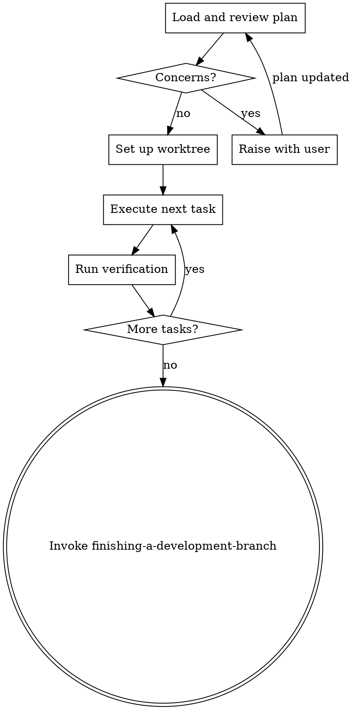

# Executing Plans

Implement an approved plan in controlled batches with explicit verification.

## Required Start

Announce: `I'm using the executing-plans skill to implement this plan.`

## Process

### Step 1: Load and Review Plan
1. Read the plan completely.
2. Review critically — identify any questions or concerns.
3. If concerns: raise them with the user before starting.
4. If no concerns: create task tracking and proceed.

### Step 2: Set Up Workspace
If working on main/master branch AND the plan involves code changes:
- Set up isolated workspace via `using-git-worktrees`.

If already on a feature branch, or the plan is documentation/config only:
- Skip worktree setup. Confirm with user that the current branch is appropriate.

### Step 3: Execute Tasks (per task)
For each task:
1. Follow each step exactly (plan has bite-sized steps with checkboxes).
2. Run the task's own test (TDD: write failing test → implement → pass). Self-review the diff against the task's interface contract.
3. Mark task complete and commit.
4. For tasks involving UI/UX or frontend implementation, apply guidance from `frontend-design`.

**No per-task reviewer.** Local defects are caught by the task's own test plus the project's static gates (typecheck/lint). The checks that matter run at higher altitude (below).

### Step 4: Verify per phase
At the end of each plan phase, run the project's **verification gate** (from CLAUDE.md/AGENTS.md — e.g. `make test-e2e`, `pnpm test`). This is the integration checkpoint that catches regressions a single task's test cannot. Do not start the next phase on a red gate; a failure after your change defaults to "my change broke it" — investigate before dismissing.

**Note:** For a large plan with independent tasks, `subagent-driven-development` runs faster (fresh context per task, parallel waves). For small or tightly-coupled plans, inline (this skill) avoids subagent overhead.

## Engineering Rigor for Complex Tasks

When a task is architectural, high-risk, or touches cross-module boundaries:
- Validate the approach against requirements and constraints before coding.
- Identify edge cases and error paths specific to this task.
- Consider simpler architectures or alternative approaches.
- Ensure changes remain maintainable and don't create hidden coupling.
- If 2 implementation attempts fail, pause and reassess the approach rather than forcing a third attempt.

## Execution Rules

- Do not skip plan steps unless user approves deviation.
- Never start implementation on main/master branch without explicit user consent — ensure isolated workspace is ready first.
- Keep edits scoped to the current task.
- Do not claim completion without fresh command output.

**Stop immediately and ask for clarification — never guess — when:**
- A dependency is missing or unavailable.
- The plan has a critical gap that prevents starting.
- An instruction is unclear or contradictory.
- Verification fails repeatedly (2+ attempts).

## Context Hygiene

For each task, keep only:
- Current task details
- Constraints
- Relevant prior decisions
- Verification evidence

Do not carry long historical summaries. Never forward full session history to subagents — construct their prompts from scratch with only the items above.

## Completion

After all phases pass the verification gate:
1. Run the **full** project verification gate (the authoritative one — e.g. the complete e2e suite, not a subset) plus any code-health/audit gate the project defines.
2. Run **one** whole-branch review over the entire diff via `requesting-code-review` (include a security pass if any task carried a `security` flag). Fix Critical/Important; note Minor.
3. Invoke `finishing-a-development-branch`.
