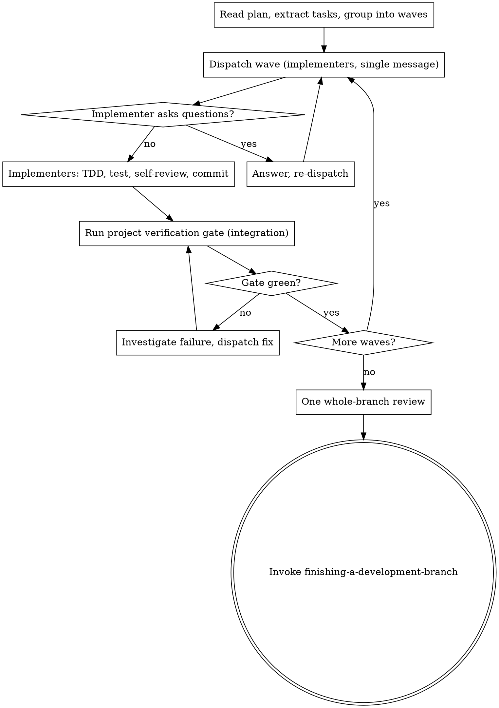

# Subagent-Driven Development

Execute a plan with fresh-context subagents. The governing idea: **put each check
where it pays off.** Per-task reviewer subagents are expensive and structurally blind
to integration regressions (each sees one diff in isolation); the project's own
verification gate catches those, deterministically. So review runs **once, before the
PR** — not after every task.

## Required Start

Announce: `I'm using subagent-driven-development to execute this plan.`

## The Three Altitudes

| Altitude | When | What runs | Catches |
|---|---|---|---|
| **Per task** | every task | implementer does TDD, runs the task's own test, self-reviews, commits. **No reviewer subagent.** | local defects, cheaply |
| **Per wave/phase** | after each wave of tasks | the project's **verification gate** (from CLAUDE.md/AGENTS.md — e.g. `make test-e2e`, `pnpm test`) | **integration regressions** — what per-task review misses |
| **Pre-PR (once)** | all tasks done | **one** whole-branch review + security pass if any task was flagged | what only reading the whole change reveals |

## Core Flow



1. Read the plan once; group tasks into waves by file overlap and dependency.
2. For each wave: dispatch implementers, resolve questions, require verification evidence per task, then run the **project verification gate** before the next wave.
3. After the last wave: run **one** whole-branch review.
4. Invoke `finishing-a-development-branch`.

## Inline vs Subagent (don't pay for context you don't need)

Before deciding, consult the ambient `<dispatch-thresholds>` block emitted by SessionStart (see `skills/using-superpowers/subagent-policy.md` for the full matrix). The rules below apply when the active tier is `aggressive`; under `balanced` the threshold is stricter (≥3 disjoint tasks required for any dispatch) and under `inline-first` dispatch is not used without explicit user opt-in.

A subagent's isolated context is a real cost. Dispatch one only when it pays off:

- **Small/coupled plan (few tasks, shared state):** execute **inline** in this session. No dispatch.
- **Large plan with independent tasks:** dispatch implementers — fresh context per task, and parallel waves win wall-clock.

Either way: **no per-task reviewer subagent.** The only review dispatch is the single whole-branch one at the end.

## Parallel Waves (for independent tasks)

When tasks are independent and touch disjoint files, dispatch them as a wave:

1. Group tasks with no shared files and no sequential dependency into one wave.
2. Dispatch all implementers in a **single message** with multiple parallel Agent calls (shared cached system-prompt prefix → each agent only pays for its small unique task prompt; staggering wastes wall-clock and cache benefit).
3. When the wave's implementers all report DONE, run the **project verification gate** — this is the integration checkpoint.
4. Update completed task checkboxes in the plan (`- [ ]` → `- [x]`); sync `state.md` if present.
5. Proceed to the next wave. Move any shared-file/shared-state task to a later sequential wave.

## Plan Drift

If implementation forces an interface to change, update the plan's `Produces`/`Consumes`
line (the single source of truth) in the same commit, so later tasks/waves read reality.

## Pre-PR Whole-Branch Review (the only review dispatch)

After every wave is green:
1. Full project verification gate (the authoritative one — e.g. the complete e2e suite, not a subset).
2. Any code-health/audit gate the project defines.
3. **One** whole-branch review over the entire diff (`git diff <merge-base>..HEAD`) using `requesting-code-review` — includes a security pass if any task carried a `security` flag. Fix Critical/Important; note Minor.
4. `finishing-a-development-branch`.

## E2E Process Hygiene

Subagents are stateless — they don't know about services started by earlier subagents.
Accumulated background processes cause port conflicts and false results. For any
E2E/service task, include in the subagent prompt:

```
Before starting any service: kill existing instances (pkill -f "<pattern>"), verify the port is free (lsof -i :<port>).
After tests: kill the service you started, verify cleanup (pgrep -f "<pattern>").
```
Exception: persistent dev servers the user keeps running — document in `state.md`.

## Handling Implementer Status

**DONE:** record verification evidence; continue the wave.
**DONE_WITH_CONCERNS:** read the concerns; address correctness/scope before continuing, note observations.
**NEEDS_CONTEXT:** provide the missing context and re-dispatch.
**BLOCKED:** assess — context problem (re-dispatch same model), needs more reasoning (more capable model), too large (split), plan is wrong (escalate). If the user is unavailable and the task is non-critical, document the block in `state.md` and advance to the next independent task. Never silently skip or mark a blocked task complete; never force the same model to retry without changes.

## Context Isolation

Never forward parent session context or history to subagents. Build each prompt from
scratch with only: task text, acceptance criteria, needed file paths, relevant
constraints. Exclude prior assistant analysis and failed hypotheses. This is also
cache-optimal: `[cached system prompt] + [small unique task prompt]` keeps the heavy
prefix shared across the wave; forwarding history makes each prefix unique and
multiplies input cost.

## Subagent Skill Leakage Prevention

Every subagent prompt MUST include:

> You are a focused subagent. Do NOT invoke any skills from the superpowers-optimized plugin. Do NOT use the Skill tool. Your only job is the task described below.

## Model Selection for Agent Tool Calls

| Model | Use for |
|---|---|
| `haiku` | file reads, summarization, log scanning, patch verification — output is data, not decisions |
| `sonnet` | default for all implementation tasks |
| `opus` | architecture analysis, multi-system debugging, the whole-branch review, tasks reasoning across many constraints |

Apply via the `model` parameter. Default `sonnet`; upgrade to `opus` only when genuinely reasoning-heavy, not merely large.

## Hard Rules

- Do not implement on `main`/`master` without explicit user permission.
- Do not skip the per-wave verification gate or the final whole-branch review.
- Do not reintroduce per-task reviewer subagents — the wave gate + one final review is the design.
- Do not accept unresolved review findings.
- Do not make subagents read long plan files when task text can be passed directly.

## Prompt Templates

- `./implementer-prompt.md`
- Final review: `requesting-code-review` templates.

## Integration

- Set up workspace first with `using-git-worktrees`.
- Finish with `finishing-a-development-branch`.
